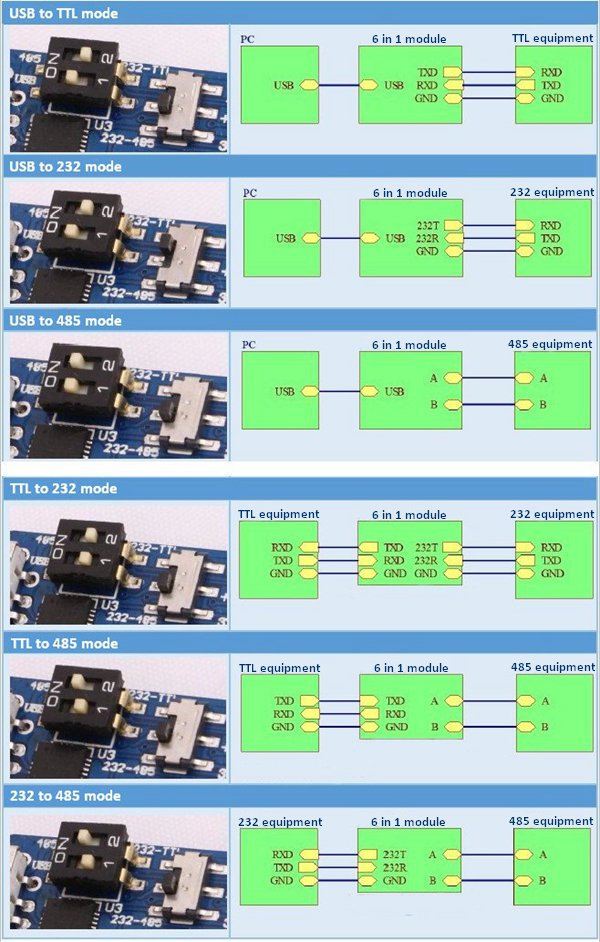

# vt100-pidp-serial

Configuration and scripts for connecting to multiple PiDP replicas from VT-100 replica via serial cable

[](https://www.youtube.com/watch?v=7QOZns_Tpzw)

## Intro

This is my configuration for the following setup:

- PiDP-8 with a [USB to Serial Adapter](https://www.amazon.com/gp/product/B00LZVEQEY)
- PiDP-11 with the same adapter
- VT-100 built according to [these instructions](https://www.instructables.com/23-Scale-VT100-Terminal-Reproduction/) with [this serial hat](https://www.amazon.com/gp/product/B083D27NJD)
  The adapters are wired to [DB9 connectors](https://www.amazon.com/gp/product/B00HGALIUS) on backpanel of each unit, and both PiDP-8 and PiDP-11 are connected to the two DB9 connectors on VT-100 with [serial cables](https://www.amazon.com/gp/product/B00006B8BJ)

## USB-to-Serial Adapter Configuration

The switches on the Adapter need to be set for "USB to 232" mode (as shown in the second line on the image):
| Switch | Position |
|--------|----------|
| 1 | On |
| 2 | Off |
| 232-TTL/232-485 | 232-TTL |



## USB-to-Serial Adapter to DB9 Connector Wiring

Technically, this setup only requires TXD, RXD and GND pins to be connected, but I prefer to wire the five pins below - in case I need to make changes later.

| Adapter Pin | DB9 Pin |
| ----------- | ------- |
| 232T        | 3 TXD   |
| 232R        | 2 RXD   |
| GND         | 5 GND   |
| DTR         | 4 DTR   |
| RTS         | 7 RTS   |

## VT-100 Setup

### Hat-Specific setup

The documentation for the hat I am using is [here](https:bit.ly/3OOT9ch)
All that is required to make it work is adding the following line to `/boot/config.txt` or `/boot/firmware/config.txt` - depending on system version on Raspberry Pi:

`dtoverlay=sc16is752-spi1,int_pin=24`

Reboot the Pi and check that you now have devide files `/dev/ttySC0` and `/dev/ttySC1`.

### The three options

There are three ways of connecting to PiDP over serial port:

- Using tio (or minicom)
  This is the simplest option that requires least effort
- Using vt100 simulator
  This is more complicated - requires downloading and compiling the simulator. The simulator can also run into issues with the serial port settings and can take a lot of troubleshooting.
- Using vt100 with tio - a workaround if the simulator runs into issues. In this case, tio can be substituted instead of the tty device name. One issue to be aware of is that the simulator expects a single name without arguments - so, for this to work we create a script with all the tio parameters inside and pass the script name to the simulator.

### Option 1 (Using tio)

#### Console Font Setup

run

```
sudo dpkg-reconfigure console-setup
```

Leave the first two selections at default values, choose "Terminus" as the font and 14x28 as the font size. On my console, this gives me 85x31. Not ideal, but close enough.

#### Install tio

```
sudo apt install tio
```

### Option 2 (Using terminal-simulator)

Install the libraries, download and compile the simulator.

```
sudo apt install libsdl2-dev
sudo apt install libsdl2-image-dev
git clone https://github.com/larsbrinkhoff/terminal-simulator.git
cd terminal-simulator/vt100
make all
cd ../vt52
make all
```

### Option 3 (Using terminal-simulator with tio)

Follow instructions for both option 1 (you can skip font setup step) and option 2

### Script Setup

This will setup the script that can run on login automatically. It's not technically necessary, just a convenience

```
sudo apt install dialog
```

If using option 3, edit the pdp8.sh and pdp11.sh scripts - whichever applies to your configuration and modify the device name if needed.
Edit the login.sh script - uncomment the option that you're using, update or remove any menu options.

Add the login.sh script to your .profile - as the last line

```
~/vt100-pidp-serial/login.sh
```

## PiDP Setup

This applies both to PiDP-8 and PiDP-11.

### Adapter-specific setup

The best way to see the device name that gets assigned is to `ls /dev/tty*` before and after plugging in the USB-to-Serial adapter. In my setup, it's `/dev/ttyUSB0`.
Run

```
sudo systemctl enable serial-getty@ttyUSB0.service
sudo systemctl start serial-getty@ttyUSB0.service
```

To turn on autologin for serial port, edit the file `/etc/systemd/system/getty.target.wants/serial-getty@ttyUSB0.service` (name will differ based on your tty port name).
Find the line that starts with `ExecStart`, comment it out and add this line instead:

```
ExecStart=-/sbin/agetty --autologin pi --noclear --keep-baud 115200,57600,38400,9600 - $TERM
```

## Connecting

On connect, you will likely see either a blank screen (if using option 2) or tio connection message (if using options 1 or 3). If you have the PDP emulator opening automatically on login, you can refresh the screen with `Ctrl-A l` shortcut.
Keep in mind that as far as keyboard shortcuts go, with option 1 you have tio on the terminal machine (`Ctrl-T` shortcuts) and screen (`Ctrl-a` shortcuts) on the PiDP machine. With option 2 you have vt100 simulator (standard VT100 shortcuts) and screen. And with option 3 you have a combination of all three sets of shortcuts.

When using tio, the way to end session is `Ctrl-t q`, and the way to send `Ctrl-t` to the remote host is `Ctrl-t Ctrl-t`.
With option 3, closing tio will also close the terminal simulator.
with option 2, `F9` gets you to Setup-A, `Ctrl-F11` closes the terminal simulator.

Good luck!
